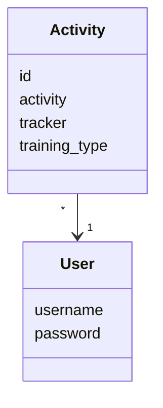
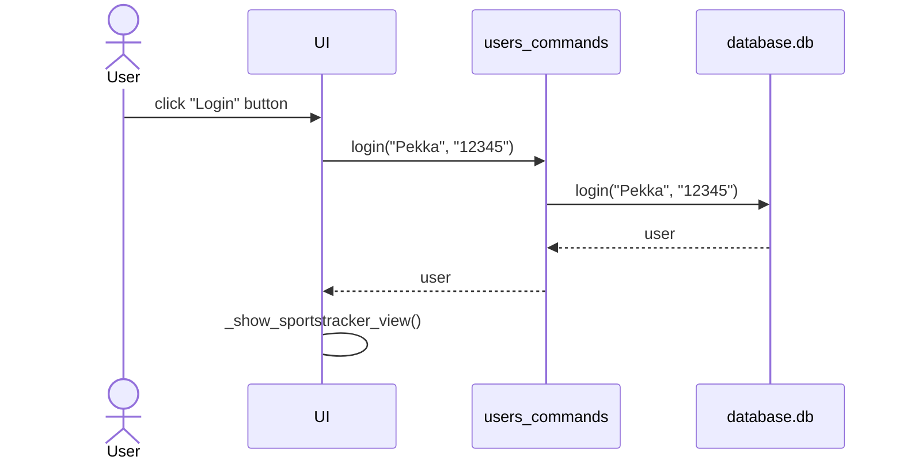

## Luokkakaavio

```mermaid
 classDiagram
      Activity "*" --> "1" User
      class User{
          username
          password
      }
      class Activity{
          id
          activity
          tracker
	  training_type
      }
```

## Sekvenssikaavio

### Sisäänkirjautuminen

```mermaid
sequenceDiagram
  actor User
  participant UI
  participant users_commands
  participant database.db
  User->>UI: click "Login" button
  UI->>users_commands: login("Pekka", "12345")
  users_commands->>database.db: login("Pekka", "12345")
  database.db-->>users_commands: user
  users_commands-->>UI: user
  UI->UI: _show_sportstracker_view()
```
