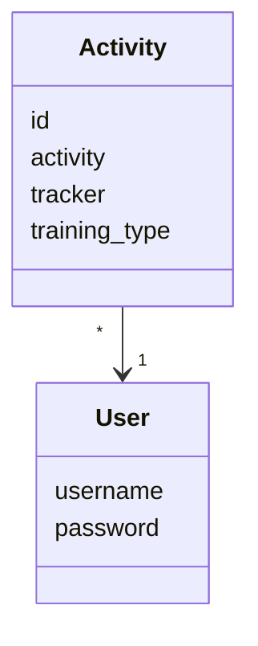
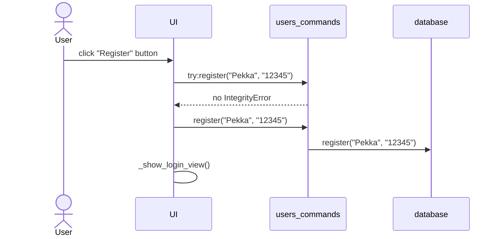
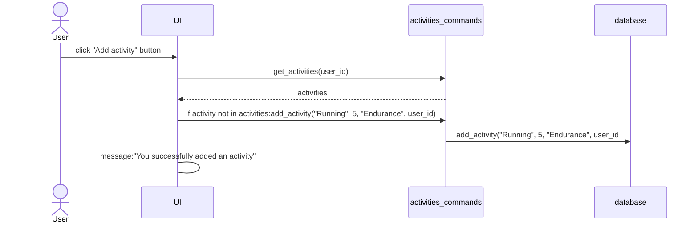
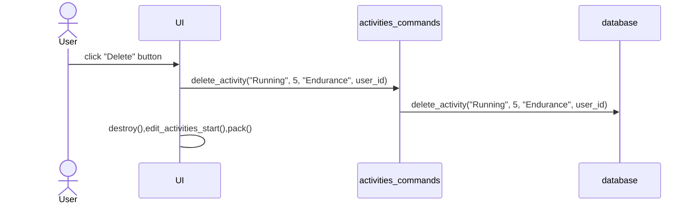

# Arkkitehtuurikuvaus

## Rakenne

Ohjelman rakenne noudattaa kolmitasoista kerrosarkkitehtuuria.

- UI
- Backend
- Database

UI vastaa sovelluksen käyttöliittymästä, Backend SQL-komennoista, sekä Database tietokannasta.

## Käyttöliittymä

Käyttöliittymä sisältää viisi erilaista näkymää:

- Kirjautuminen.
- Uuden käyttäjän luominen.
- Sportstracker-näkymä.
- Uusien liikuntasuoritusten lisäys.
- Käyttäjän liikuntasuoritusten muokkaus.

Jokainen käyttöliittymän osa on omassa tiedostossaan ja muodostaa oman luokkansa. Näkymistä vain yksi näkyy kerrallaan. UI-luokka vasta eri näkymien näyttämisestä vuorollaan.

## Sovelluslogiikka

Sovelluksen loogisen tietomallin muodostavat tietokannan taulujen entiteetit User ja Activity, jotka kuvaavat käyttäjiä ja käyttäjien liikuntasuorituksia.

Toiminnallisista kokonaisuuksista vastaa Backend, joka jakautuu komentojen osalta users-commands ja activities-commands tiedostoihin.

users-commands tiedoston käskyjä ovat esimerkiksi:

`login(username, password)`

`register(username, password)`

activities-commands tiedoston käskyjä ovat esimerkiksi:

`add-activity(activity, tracker, training-type, user-id)`

`delete-activity(activity, tracker, training-type, user-id)`

## Tietojen pysyväistallennus

Backend hoitaa tietojen tallennuksen SQLite-tietokantaan luomalla tietokannan ja taulut tietokantaan build.py tiedostossa. db.py hoitaa yhteyden luonnin tietokantaan ja activities-commands, sekä users-commands tiedostot toteuttavat SQL-komennot. Käyttäjät tallennetaan database.db tiedoston tauluun `users` ja liikuntasuoritukset tauluun `activities`.

## Päätoiminnallisuudet

### Sisäänkirjautuminen

Kun kirjautumisnäkymän syötekenttiin kirjoitetaan käyttäjätunnus ja salasana, minkä jälkeen klikataan painiketta Login, etenee sovelluksen kontrolli seuraavasti:

Painikkeen painamiseen reagoiva tapahtumankäsittelijä kutsuu sovelluslogiikan users_commands funktiota login antaen parametriksi käyttäjätunnuksen ja salasanan. Sovelluslogiikka selvittää tietokannasta onko käyttäjätunnus olemassa ja täsmääkö salasanat. Jos nämä asiat onnistuvat, kirjautuminen onnistuu. Tämän seurauksena käyttöliittymä vaihtaa näkymäksi Sportstracker, eli sovelluksen varsinaisen päänäkymän ja näyttää käyttäjälle hänen liikuntasuorituksensa. 

### Uuden käyttäjän luominen

Kun uuden käyttäjän luomisnäkymässä on syötetty käyttäjätunnus, joka ei ole jo käytössä, sekä salasanat, jotka täsmäävät keskenään, minkä jälkeen klikataan "Register" etenee sovelluksen kontrolli seuraavasti:

Tapahtumakäsittelijä kutsuu users_commands tiedoston funktiota register antaen parametreiksi käyttäjätunnuksen ja salasanan. Sovelluslogiikka selvittää onko käyttäjätunnus jo olemassa tietokannassa. Jos käyttäjää ei löydy, luodaan tietokantaan uusi käyttäjä. Tämän jälkeen käyttöliittymä vaihtaa näkymäksi Login, josta uudella käyttäjällä voidaan kirjautua sisään. 

### Liikuntasuorituksen luominen

Uuden liikuntasuorituksen luovan "Add activity"-painikkeen klikkaamisen jälkeen sovelluksen kontrolli etenee seuraavasti:

Tapahtumakäsittelijä kutsuu activities-commands tiedoston funktiota get-activities, minkä jälkeen tarkastetaan onko kyseisellä käyttäjällä olemassa jo kyseinen liikuntasuoritus. Jos ei ole, kutsutaan funktiota add_activity, mikä lisää liikuntasuorituksen tietokantaan. Lopuksi käyttöliittymä kertoo viestillä onnistuneesti lisätystä liikuntasuorituksesta.

### Liikuntasuorituksen poistaminen

Liikuntasuorituksen poistavan "Delete" painikkeen klikkaamisen jälkeen sovelluksen kontrolli etenee seuraavasti:

Tapahtumakäsittelijä kutsuu activities-commands tiedoston funktiota delete_activity antaen parametriksi poistettavan liikuntasuorituksen tiedot. Komento poistaa liikuntasuorituksen tietokannasta. Tämän jälkeen UI käynnistää näkymän uudestaan, jotta sivun lista liikuntasuorituksista päivittyy.
