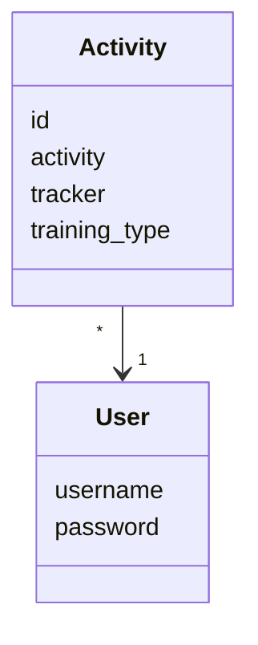

```mermaid
 classDiagram
      Activity "*" --> "1" User
      class User{
          username
          password
      }
      class Activity{
          id
          activity
          tracker
	  training_type
      }
```
