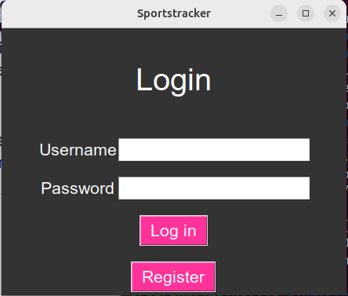
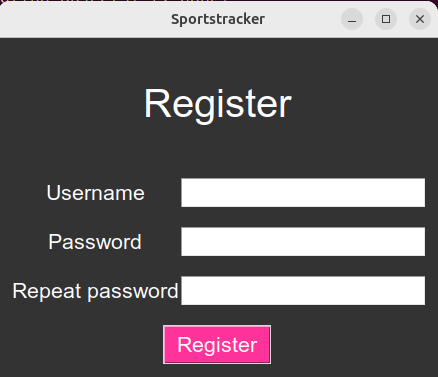
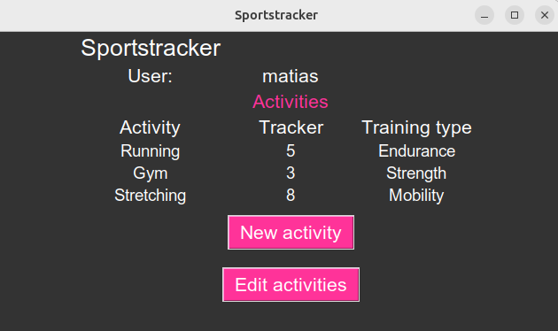
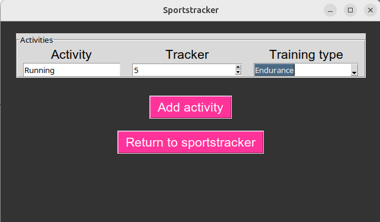
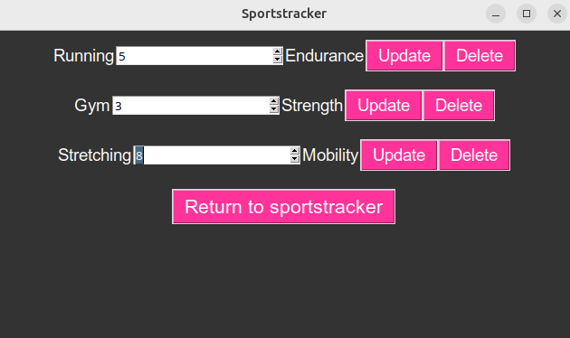

# Käyttöohje

Lataa projektin viimeisin [release](https://github.com/MatiasS717/Sportstracker/releases/tag/loppupalautus).

## Konfigurointi

Käytettävän tietokannan nimeä voi muuttaa halutessaan .env-tiedostossa. Alustavasti tietokannan nimi on database.db.

## Ohjelman käynnistäminen

Asenna riippuvuudet komennolla:

`poetry install`

Suorita alustustoimenpiteet komennolla:

`poetry run invoke build`

Käynnistä ohjelma komennolla:

`poetry run invoke start`

## Sisään kirjautuminen

Sovelluksen käynnistäessä siirrytään automaattisesti sisäänkirjautumisnäkymään.

Kirjoita syötekenttiin käyttäjätunnus ja salasana. Paina "Login"-nappia.

Siirtyäksesi uuden käyttäjän luomis -näkymään, paina "Register"-nappia.

## Uuden käyttäjän luominen (rekisteröinti)

Täytä syötekentät ja paina "Register"-nappia.

Onnistuneen käyttäjän luonnin jälkeen siirryt takaisin sisään kirjautumis -näkymään.

## Liikuntasuoritusten tarkastelu

Kirjauduttuasi sisään pääset Sportstracker näkymään, jossa näkyy liikuntasuorituksesi.

Tästä näkymästä pääset luomaan uusia liikuntasuorituksia painamalla "New activity"-nappia.

Olemassa olevia liikuntasuorituksia pääset muokkaamaan painamalla "Edit activities"-nappia.

## Uuden liikuntasuorituksen luonti

Siirryttyäsi NewActivities näkymään Sportstracker näkymästä painamalla "New activity"-nappia, pystyt luomaan uusia liikuntasuorituksia täyttämällä annetut syötekentät haluamillasi tiedoilla ja painamalla sen jälkeen "Add activity"-nappia.

Pääset takaisin tarkastelemaan liikuntasuorituksiasi painamalla "Return to sportstracker"-nappia.

## Liikuntasuoritusten poistaminen ja liikuntakertojen muuttaminen

Siirryttyäsi EditActivities näkymään Sportstracker näkymästä painamalla "Edit activities"-nappia, pystyt poistamaan liikuntasuorituksia painamalla kyseisen suorituksen kohdalta "Delete"-nappia.

Samassa näkymässä voit päivittää liikuntakertojen määrää täyttämällä oikean numeron annettuun kenttään ja painamalla "Update"-nappia.

Pääset takaisin Sportstracker näkymään painamalla "Return to sportstracker"-nappia.
