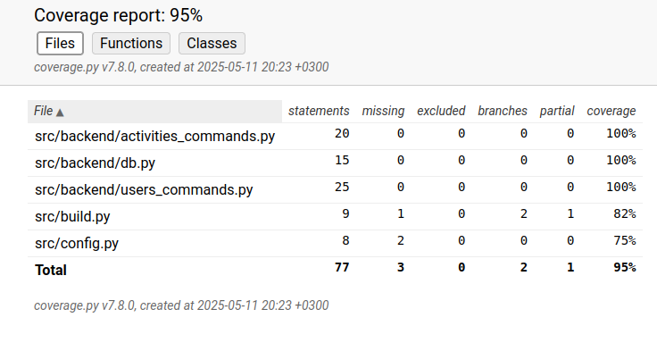

# Testausdokumentti

Ohjelmaa on testattu unittestin avulla. Sovelluksen toiminnallisuutta on testattu manuaalisesti.

## Testikattavuus

Sovelluksen testauksen haarautumakattavuus on 97%. Testaus ei sisältänyt käyttöliittymän tiedostoja.

Tiedostoille activities-commands.py, users-commands.py, sekä build.py on omat testitiedostonsa. db.py tiedostoa käytetään activities-commands ja users-commands tiedostoissa, joten sen testaus tapahtui näiden tiedostojen kautta. build.py tiedoston testaus kattoi pienen osan activities-commands ja users-commands tiedostojen funktioiden testaamisesta.

## Sovelluksen toiminnallisuuden testaus

Kaikki sovelluksen toiminnallisuudet on testattu manuaalisesti kokeilemalla syöttää tyhjiä tai valmiiksi olemassa olevia arvoja.

## Sovellukseen jääneet ongelmat

Sovellus vaatii README-tiedostossa mainitut alustukset, eikä välttämättä osaa ilmoittaa järkevästi niiden puuttumisesta. Esimerkiksi jos tietokantaa ei ole alustettu käskyllä `poetry run invoke build`, sovellus kyllä käynnistyy, mutta kaatuu heti kun tietokantaan täytyisi päästä käsiksi. 
