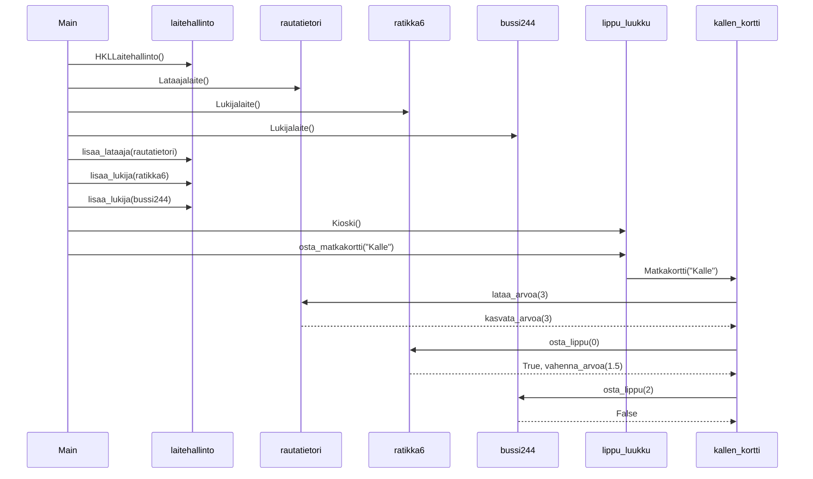

## HSL-matkakorttien hallinta

```mermaid
sequenceDiagram
  participant Main
  participant laitehallinto
  Main->>laitehallinto: HKLLaitehallinto()
  participant rautatietori
  Main->>rautatietori: Lataajalaite()
  participant ratikka6
  Main->>ratikka6: Lukijalaite()
  participant bussi244
  Main->>bussi244: Lukijalaite()
  Main->>laitehallinto: lisaa_lataaja(rautatietori)
  Main->>laitehallinto: lisaa_lukija(ratikka6)
  Main->>laitehallinto: lisaa_lukija(bussi244)
  participant lippu_luukku
  Main->>lippu_luukku: Kioski()
  Main->>lippu_luukku: osta_matkakortti("Kalle")
  participant kallen_kortti
  lippu_luukku->>kallen_kortti: Matkakortti("Kalle")
  kallen_kortti->>rautatietori: lataa_arvoa(3)
  rautatietori-->>kallen_kortti: kasvata_arvoa(3)
  kallen_kortti->>ratikka6: osta_lippu(0)
  ratikka6-->>kallen_kortti: True, vahenna_arvoa(1.5)
  kallen_kortti->>bussi244: osta_lippu(2)
  bussi244-->>kallen_kortti: False
```
