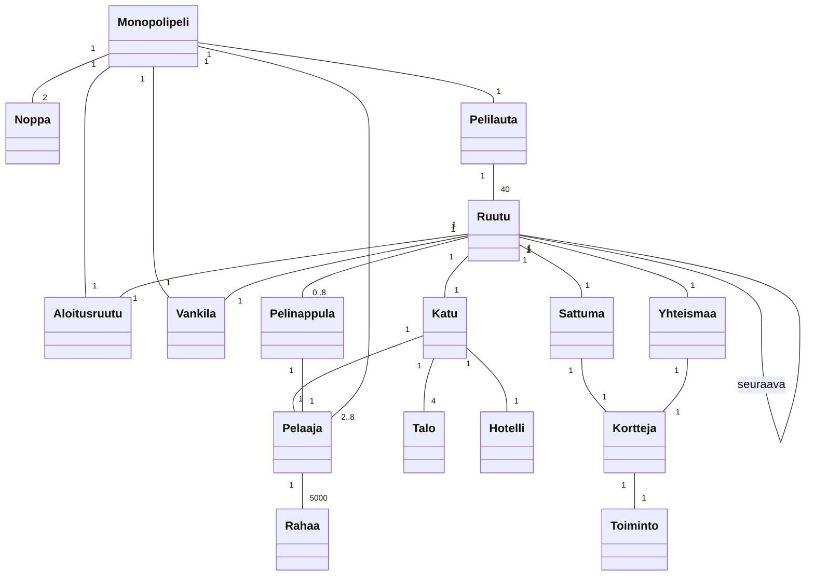

## Monopoli, alustava luokkakaavio

```mermaid
 classDiagram
    Monopolipeli "1" -- "2" Noppa
    Monopolipeli "1" -- "1" Pelilauta
    Monopolipeli "1" -- "1" Aloitusruutu
    Monopolipeli "1" -- "1" Vankila
    Pelilauta "1" -- "40" Ruutu
    Ruutu "1" -- "1" Aloitusruutu
    Ruutu "1" -- "1" Vankila
    Ruutu "1" -- "1" Katu
    Katu "1" -- "1" Pelaaja
    Pelaaja "1" -- "5000" Rahaa
    Katu "1" -- "4" Talo
    Katu "1" -- "1" Hotelli
    Ruutu "1" -- "1" Sattuma
    Sattuma "1" -- "1" Kortteja
    Kortteja "1" -- "1" Toiminto
    Ruutu "1" -- "1" Yhteismaa
    Yhteismaa "1" -- "1" Kortteja
    Ruutu "1" -- "1" Ruutu : seuraava
    Ruutu "1" -- "0..8" Pelinappula
    Pelinappula "1" -- "1" Pelaaja
    Pelaaja "2..8" -- "1" Monopolipeli
```
